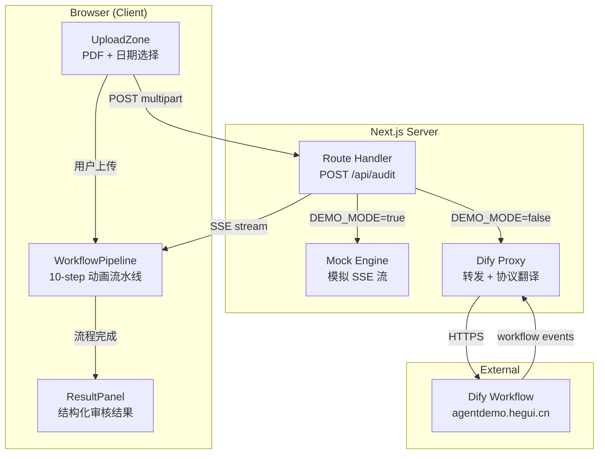
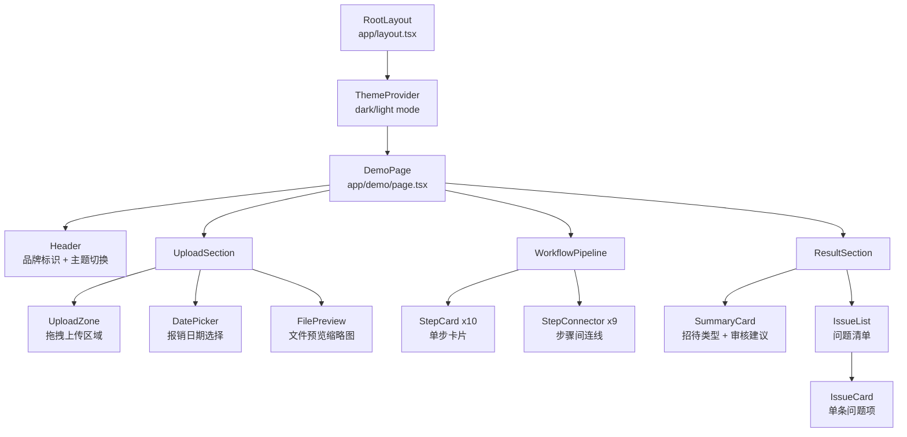
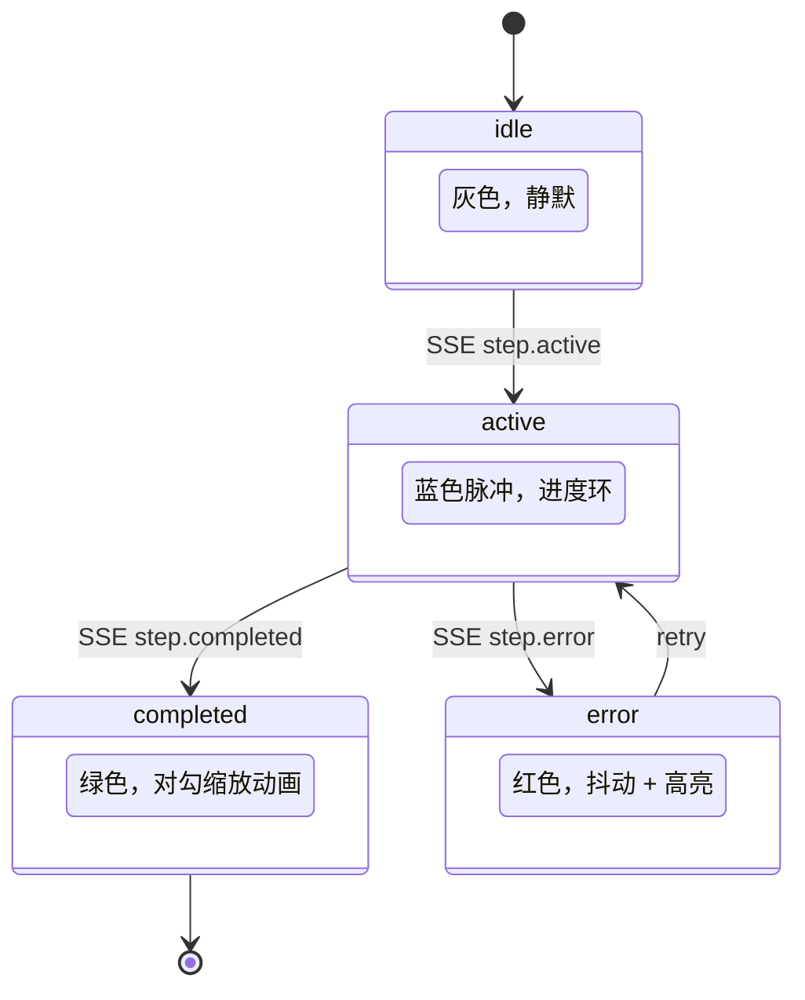
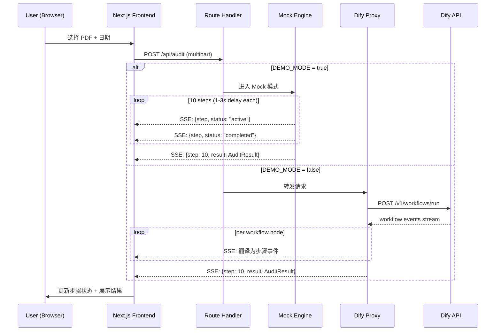
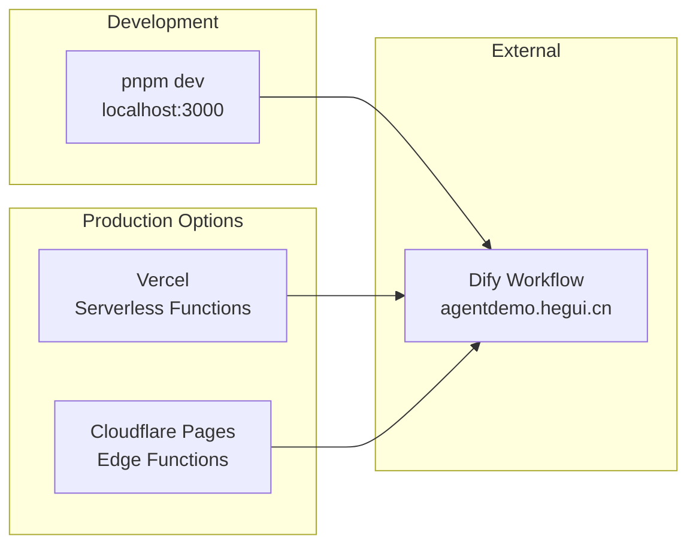
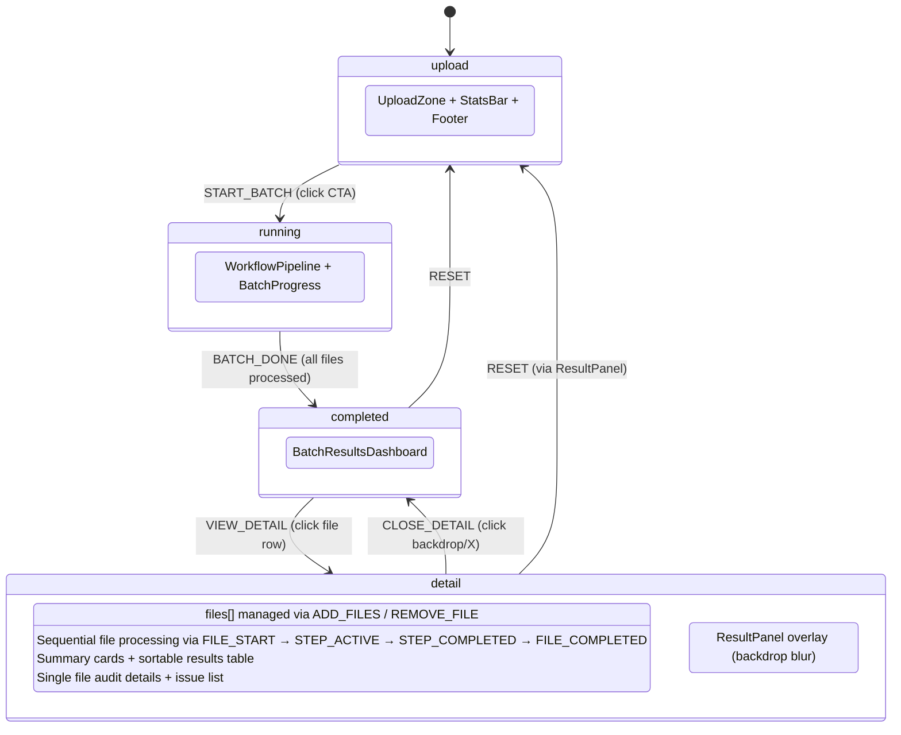

# System Architecture -- 路桥报销审核智能体 Demo

> SYSTEM_ARCHITECTURE | v2.1 | 2026-03-10

---

## 1. Overview

本系统是 Dify 工作流的定制化展示前端，替代 Dify 原生 UI，为路桥集团国企客户提供"卧槽级"演示体验。
v2.0 升级为批量审核作战系统，支持文件夹拖拽、批量 10 步工作流可视化、仪表盘级结果汇总。

**设计原则**:
- **无状态**: 无数据库、无用户体系、无持久化，纯展示型前端
- **双模式**: Mock (离线演示) + Live (对接 Dify API)，通过环境变量一键切换
- **代理隔离**: API Key 仅存于服务端 Route Handler，前端永远不接触密钥
- **单屏渐进披露**: 4 个 Phase (upload→running→completed→detail) 在 100vh 内通过 Framer Motion 动画过渡，零滚动
- **批量处理**: 支持 100 个 PDF 文件批量审核，逐文件 10 步流水线执行

---

## 2. High-level Architecture



---

## 3. Component Architecture

### 3.1 组件层级



### 3.2 核心组件职责 (v2.0 actual)

| Component | File | Phase | Responsibility |
|-----------|------|-------|---------------|
| `AnimatedBackground` | `components/layout/AnimatedBackground.tsx` | all | Canvas noise + CSS grid + radial gradients + floating particles |
| `Header` | `components/layout/Header.tsx` | all | 品牌标识 + 版本号 + AI 引擎状态 |
| `StatsBar` | `components/layout/StatsBar.tsx` | upload | 4 个 KPI 卡片 (步骤数/准确率/耗时/服务时间) + glass-shimmer |
| `UploadZone` | `components/upload/UploadZone.tsx` | upload | 文件/文件夹拖拽 + 文件列表表格 + 手写比例 + 日期选择 + CTA |
| `WorkflowPipeline` | `components/workflow/WorkflowPipeline.tsx` | running | 10 步 2x5 网格 + 水平/垂直连线 + 活跃步骤详情 |
| `StepCard` | `components/workflow/StepCard.tsx` | running | 单步卡片 (idle/active/completed/error) |
| `BatchProgress` | `components/batch/BatchProgress.tsx` | running | 圆形总进度 + 文件卡片列表 + 步骤点阵 + 呼吸光效 |
| `BatchResultsDashboard` | `components/batch/BatchResultsDashboard.tsx` | completed | 3 汇总卡 + 4 统计指标 + 可排序结果表 + 动画计数器 |
| `ResultPanel` | `components/result/ResultPanel.tsx` | detail | 单文件审核结果 (招待类型+建议+问题列表+复制) |
| `IssueCard` | `components/result/IssueCard.tsx` | detail | 单条审核问题项 (severity badge + detail) |

### 3.3 StepCard 状态机



---

## 4. Data Flow

### 4.1 完整请求链路



### 4.2 SSE Event Schema

```typescript
// 步骤进度事件
interface StepEvent {
  step: number;        // 1-10
  status: "active" | "completed" | "error";
  message: string;     // e.g. "正在判定报销过期日..."
}

// 最终结果事件 (step=10, status=completed)
interface ResultEvent extends StepEvent {
  result: AuditResult;
}

interface AuditResult {
  reception_type: string;   // e.g. "公务接待"
  suggestion: "通过" | "人工复核" | "不通过";
  issues: AuditIssue[];
}

interface AuditIssue {
  severity: "error" | "warning" | "info";
  message: string;          // e.g. "菜品清单缺失"
}
```

---

## 5. Tech Stack

### 5.1 技术选型 (actual)

| Layer | Technology | Version | Rationale |
|-------|-----------|---------|-----------|
| Framework | Next.js | 16.1.6 | App Router + Turbopack + Route Handlers |
| Runtime | React | 19.2.3 | Concurrent features + Server Components |
| Styling | TailwindCSS | 4.x | CSS variable system, utility-first |
| Components | shadcn/ui | latest | 无锁定、可定制 (仅 cn() utility 使用) |
| Animation | Framer Motion | 12.35.2 | AnimatePresence + layout animations |
| Icons | Lucide React | latest | Tree-shakeable，~20 icons used |
| State | useReducer | -- | 12 action types, 4 phases, single state tree |
| Package Manager | pnpm | 10.28.2 | 快速、磁盘高效 |
| Node | Node.js | 25.6.0 | |

### 5.2 不使用的技术 (及原因)

| Technology | Reason for Exclusion |
|-----------|---------------------|
| Database (Prisma/Drizzle) | 无状态 Demo，无需持久化 |
| Auth (NextAuth/Clerk) | 无用户体系 |
| External state (Redux/Zustand) | 单页面，React hooks 足够 |
| Testing framework | Demo 项目，手动验证优先 |
| i18n | v1.0 仅中文 |

---

## 6. Directory Structure (actual)

```
21-dify-demo/
├── src/
│   ├── app/
│   │   ├── layout.tsx            # Root layout (Inter font, dark class)
│   │   ├── page.tsx              # Main orchestrator (useReducer, 4 phases)
│   │   ├── globals.css           # Theme tokens + glassmorphism + animations (~415 lines)
│   │   └── api/audit/route.ts    # POST handler (placeholder for Dify integration)
│   ├── components/
│   │   ├── layout/
│   │   │   ├── AnimatedBackground.tsx  # Canvas noise + CSS grid + radials + particles
│   │   │   ├── Header.tsx              # Brand header + AI engine badge
│   │   │   └── StatsBar.tsx            # 4 KPI stat cards
│   │   ├── upload/
│   │   │   └── UploadZone.tsx          # Dropzone + file table + date + CTA (~635 lines)
│   │   ├── workflow/
│   │   │   ├── WorkflowPipeline.tsx    # 2x5 step grid + connectors (~242 lines)
│   │   │   └── StepCard.tsx            # Single step card with 4 states
│   │   ├── batch/
│   │   │   ├── BatchProgress.tsx       # Circular progress + file cards (~572 lines)
│   │   │   └── BatchResultsDashboard.tsx # Summary + stats + sortable table (~711 lines)
│   │   ├── result/
│   │   │   ├── ResultPanel.tsx         # Single file detail (overlay)
│   │   │   └── IssueCard.tsx           # Individual audit issue
│   │   └── ui/                         # shadcn/ui primitives
│   └── lib/
│       ├── types.ts              # TypeScript types (StepState, AuditResult, BatchFile, etc.)
│       ├── constants.ts          # Workflow steps, badges, app config
│       ├── mock-data.ts          # Mock audit results + step delays
│       └── utils.ts              # cn() utility
├── doc/00_project/initiative_21-dify-demo/
│   ├── PRD.md
│   ├── SYSTEM_ARCHITECTURE.md
│   ├── USER_EXPERIENCE_MAP.md
│   ├── PLATFORM_OPTIMIZATION_PLAN.md
│   ├── task_plan.md
│   └── notes.md
├── .env.example                  # DEMO_MODE, DIFY_API_URL, DIFY_API_KEY
├── next.config.ts                # Security headers (CSP, XFO, nosniff)
├── tsconfig.json
├── package.json
└── pnpm-lock.yaml
```

**Total source**: ~4,500 lines TypeScript/CSS across 12 source files.

---

## 7. API Design

### 7.1 Endpoints

| Method | Path | Content-Type | Description |
|--------|------|-------------|-------------|
| POST | `/api/audit` | `multipart/form-data` | 提交 PDF + 日期，返回 SSE 流 |

### 7.2 Request

```
POST /api/audit HTTP/1.1
Content-Type: multipart/form-data

Fields:
  file: <PDF binary>           (required, max 20MB)
  date: "2025-07-09"           (optional, default today)
```

### 7.3 Response (SSE Stream)

```
Content-Type: text/event-stream

data: {"step":1,"status":"active","message":"正在接收报销资料..."}
data: {"step":1,"status":"completed","message":"报销资料接收完成"}
data: {"step":2,"status":"active","message":"正在判定报销过期日..."}
...
data: {"step":10,"status":"completed","message":"审核完成","result":{...}}
```

### 7.4 Mock Engine 行为

Mock Engine 模拟真实工作流的时间开销，为离线演示场景设计：

| Step | Simulated Delay | Description |
|------|----------------|-------------|
| 1 | 1.0s | 报销资料输入 |
| 2 | 1.5s | 报销过期日判定 |
| 3 | 2.0s | 报销单据拆分 |
| 4 | 2.5s | 报销单据识别 (OCR, slowest) |
| 5 | 1.5s | 提取接待类型信息 |
| 6 | 1.0s | 判断接待类型 |
| 7 | 2.0s | 公务接待单据审核 |
| 8 | 1.5s | 公务接待审核内容汇总 |
| 9 | 1.0s | 审核结果编排 |
| 10 | 0.5s | 审核结果输出 |

总计约 14.5s，模拟真实审核耗时，为演示提供节奏感。

### 7.5 Dify API 对接

```mermaid
graph LR
    subgraph "Next.js Route Handler"
        REQ[Incoming Request]
        UPLOAD[Upload PDF to Dify]
        RUN[Trigger Workflow]
        TRANSLATE[Event Translator]
    end

    subgraph "Dify API (agentdemo.hegui.cn)"
        FAPI[/v1/files/upload]
        WAPI[/v1/workflows/run]
    end

    REQ --> UPLOAD
    UPLOAD -->|POST multipart| FAPI
    FAPI -->|file_id| RUN
    RUN -->|POST JSON| WAPI
    WAPI -->|workflow events| TRANSLATE
    TRANSLATE -->|SSE StepEvent| CLIENT[Browser]
```

**Dify API 调用流程**:
1. `POST /v1/files/upload` -- 上传 PDF 文件，获取 `file_id`
2. `POST /v1/workflows/run` -- 触发工作流，传入 `file_id` + `date`
3. Dify 返回 workflow node 执行事件，Proxy 翻译为 10-step SSE 事件

---

## 8. Environment Configuration

| Variable | Default | Required | Description |
|----------|---------|----------|-------------|
| `DEMO_MODE` | `true` | No | `true` = Mock 模式, `false` = Live Dify API |
| `DIFY_API_URL` | `https://agentdemo.hegui.cn` | No | Dify 工作流 API 地址 |
| `DIFY_API_KEY` | (empty) | Live mode only | Dify API Bearer Token |
| `NEXT_PUBLIC_APP_NAME` | `路桥报销审核智能体` | No | 前端显示的应用名称 |

**安全约束**:
- `DIFY_API_KEY` 仅在 `.env.local` 中配置，仅服务端 Route Handler 可访问
- 前端代码不使用 `NEXT_PUBLIC_DIFY_API_KEY` 前缀，确保密钥不泄露
- `.env.local` 已加入 `.gitignore`

---

## 9. Deployment Architecture



**部署方式**:

| Platform | Build Command | Output | API Routes |
|----------|--------------|--------|------------|
| Vercel | `pnpm build` | `.next/` | Serverless Functions (auto) |
| Cloudflare Pages | `pnpm build` | `.next/` | Edge Functions (via `@cloudflare/next-on-pages`) |
| Static Export | `next export` (不推荐) | `out/` | 不支持 (需外部 API) |

**推荐**: Vercel 部署最简，Route Handlers 自动转为 Serverless Functions，零配置。

---

## 10. Performance Budget

| Metric | Target | Measurement |
|--------|--------|-------------|
| LCP | < 2.0s | Lighthouse |
| FCP | < 1.5s | Lighthouse |
| CLS | < 0.1 | Lighthouse |
| Bundle (gzipped) | < 500KB | `next build` output |
| Animation FPS | 60fps | Chrome DevTools Performance |
| SSE latency | < 100ms per event | Network tab |

**优化策略**:
- Next.js App Router 自动 code splitting
- shadcn/ui 按需导入，无全量打包
- Framer Motion `LazyMotion` 减少初始包体积
- Lucide React tree-shaking，仅打包使用的图标
- 图片/字体使用 `next/image` + `next/font`

---

## 11. Security Considerations

| Concern | Mitigation |
|---------|-----------|
| API Key 泄露 | Key 仅存于服务端 `.env.local`，通过 Route Handler 代理访问 |
| 文件上传攻击 | 服务端校验 MIME type (application/pdf)，限制 20MB |
| XSS | React 默认 escape，不使用 `dangerouslySetInnerHTML` |
| CORS | Route Handler 同源，无跨域问题 |
| 依赖供应链 | pnpm lockfile + `pnpm audit` |

---

## 12. 10-Step Workflow Definition

供前端常量表使用，单一定义源（`lib/constants.ts`）。

| Step | Key | Name (CN) | Name (EN) | Icon (Lucide) | Est. Duration |
|------|-----|-----------|-----------|---------------|--------------|
| 1 | `document_input` | 报销资料输入 | Document Input | `FileUp` | 1.0s |
| 2 | `expiry_check` | 报销过期日判定 | Expiry Check | `Calendar` | 1.5s |
| 3 | `receipt_split` | 报销单据拆分 | Receipt Splitting | `Scissors` | 2.0s |
| 4 | `receipt_ocr` | 报销单据识别 | Receipt Recognition | `Scan` | 2.5s |
| 5 | `extract_info` | 提取接待类型信息 | Extract Reception Info | `Search` | 1.5s |
| 6 | `classify_type` | 判断接待类型 | Determine Reception Type | `GitBranch` | 1.0s |
| 7 | `audit_docs` | 公务接待单据审核 | Official Reception Audit | `Shield` | 2.0s |
| 8 | `audit_summary` | 公务接待审核内容汇总 | Audit Summary | `ClipboardList` | 1.5s |
| 9 | `result_format` | 审核结果编排 | Result Arrangement | `Layout` | 1.0s |
| 10 | `result_output` | 审核结果输出 | Result Output | `FileCheck` | 0.5s |

---

## 13. Decision Log

| # | Date | Decision | Options Considered | Rationale |
|---|------|----------|-------------------|-----------|
| D-001 | 2026-03-10 | 单页面流转（非多页路由） | (A) 多页路由 /upload, /workflow, /result (B) 单页三段式 (C) 全屏步进式 | 演示场景需要连贯体验，单页避免页面跳转中断动画节奏 |
| D-002 | 2026-03-10 | SSE 而非 WebSocket | (A) WebSocket (B) SSE (C) Polling | SSE 单向推送足够，Next.js Route Handler 原生支持，无需额外基础设施 |
| D-003 | 2026-03-10 | Mock + Live 双模式 | (A) 仅 Live (B) 仅 Mock (C) 双模式切换 | 客户现场可能无网络，Mock 模式保证离线可演示 |
| D-004 | 2026-03-10 | React hooks (无外部状态库) | (A) Zustand (B) Jotai (C) 纯 hooks | 单页面状态简单，10 个步骤的状态用 useReducer 管理足够 |
| D-005 | 2026-03-10 | Framer Motion (非 CSS 动画) | (A) 纯 CSS/TailwindCSS animate (B) Framer Motion (C) React Spring | 需要编排复杂的步骤序列动画 + 手势交互，Framer Motion 声明式 API 最适合 |

---

## 14. App State Machine (v2.0)



**Reducer actions (12 total)**:
`ADD_FILES` | `REMOVE_FILE` | `START_BATCH` | `FILE_START` | `STEP_ACTIVE` | `STEP_COMPLETED` | `FILE_COMPLETED` | `FILE_ERROR` | `BATCH_DONE` | `VIEW_DETAIL` | `CLOSE_DETAIL` | `RESET`

---

## 15. Performance Baseline (v2.1)

| Metric | Value | Target | Status |
|--------|-------|--------|--------|
| Bundle JS (gzipped) | 217KB | < 500KB | OK (43%) |
| Largest chunk (gz) | 68.5KB | -- | Framer Motion + React |
| Build time | ~3s | < 10s | OK |
| Total JS chunks | 7 | -- | Turbopack auto-split |
| CSS | ~415 lines | -- | Single globals.css |
| Source files | 12 | -- | |
| Total LOC | ~4,500 | -- | |

---

## Changelog

| Date | Version | Change |
|------|---------|--------|
| 2026-03-10 | v1.0 | Initial architecture document |
| 2026-03-10 | v2.0 | Batch audit system, 4-phase state machine, actual component hierarchy |
| 2026-03-10 | v2.1 | Swarm optimization, security headers, performance baseline, PDCA sync |

---

Maurice | maurice_wen@proton.me
