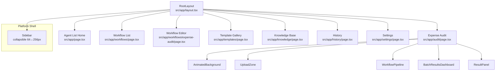
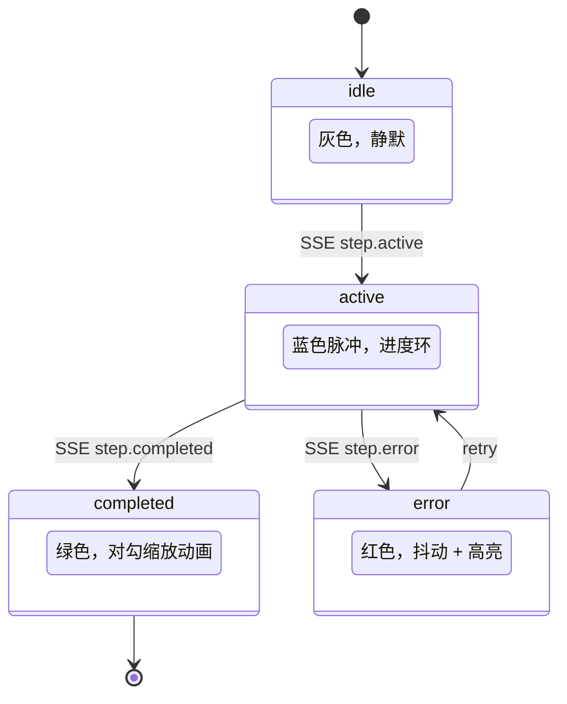
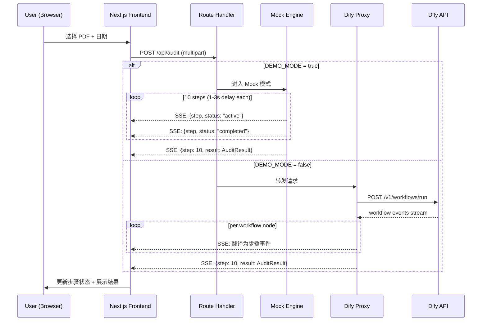
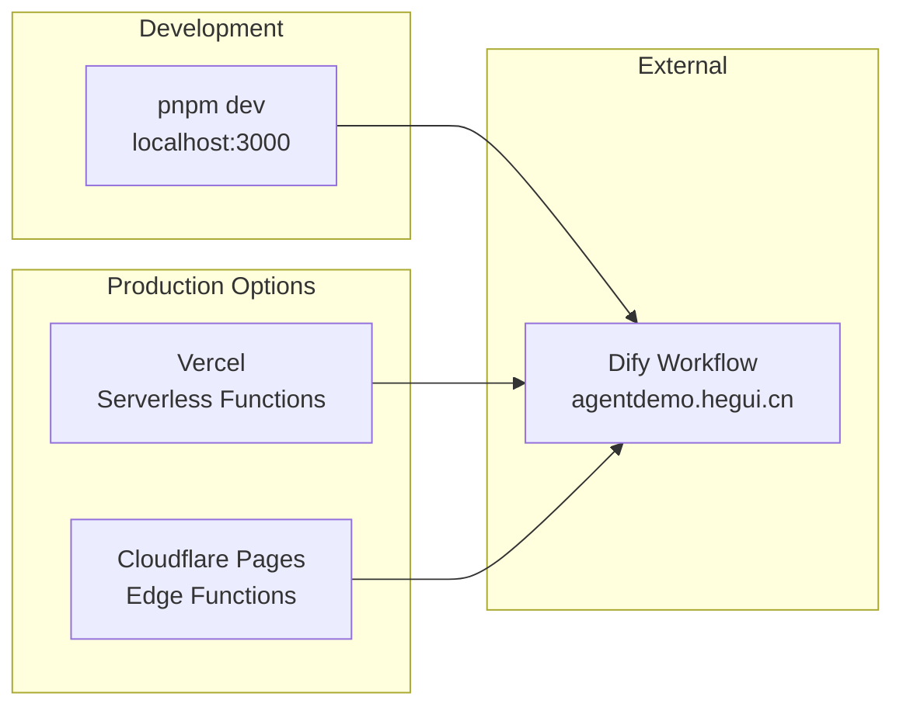
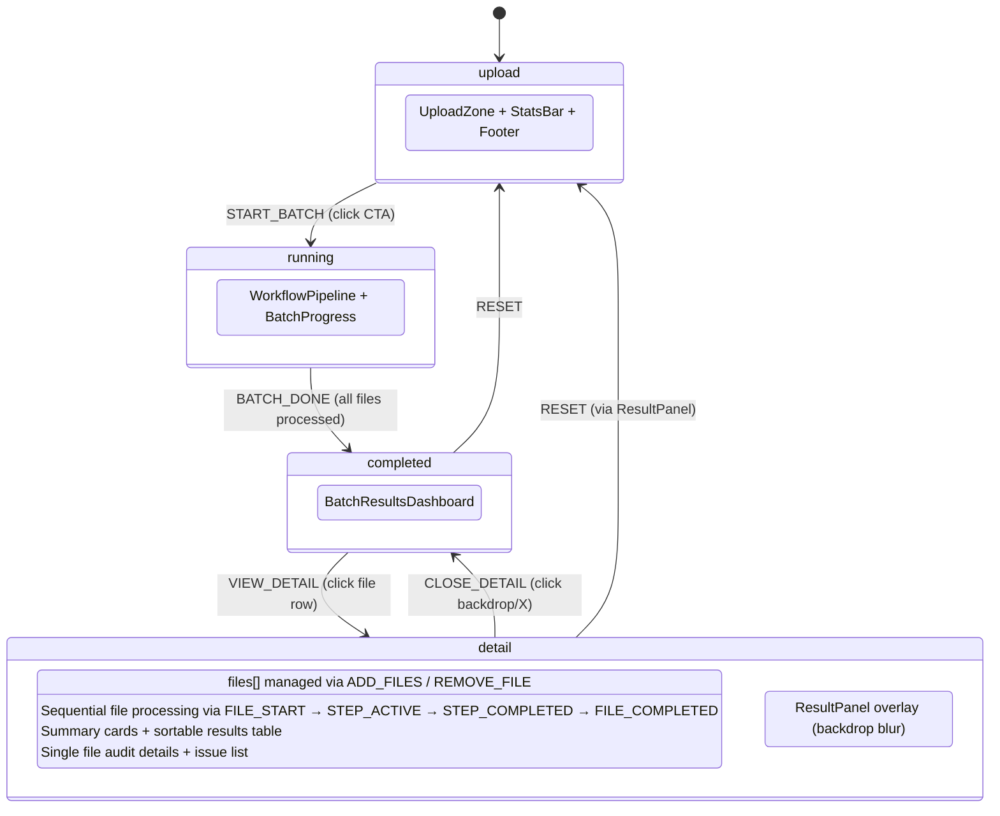

# System Architecture -- 灵阙智能体平台 Demo

> SYSTEM_ARCHITECTURE | v3.1 | 2026-03-13

---

## 1. Overview

**PROJECT_DIR**: `/Users/mauricewen/Projects/21-dify-demo`

灵阙企业智能体平台 Demo 前端，完整复刻 `07-lingque-professional` 的 B2B SaaS 架构。
v3.0 从单页审核 Demo 升级为 8 页面完整平台展示，覆盖智能体、工作流、模板、知识库、历史、设置六大模块。

**设计原则**:
- **无状态**: 无数据库、无用户体系、无持久化，纯展示型前端（Mock 数据）
- **双模式**: Mock (离线演示) + Live (对接 Dify API)，通过环境变量一键切换（仅 `/audit` 路由）
- **代理隔离**: API Key 仅存于服务端 Route Handler，前端永远不接触密钥
- **双色品牌**: 平台功能 = Sky Blue (#0284C7/#0369A1)，智能体功能 = Jade Teal (#0D9488/#0F766E)
- **Light theme**: frosted glass (backdrop-blur) + 白底毛玻璃卡片 + 微交互
- **Multi-page SPA**: Next.js App Router 多路由，左侧可收缩 Sidebar 导航
- **批量处理**: `/audit` 页面支持 100 个 PDF 文件批量审核，逐文件 10 步流水线执行

---

## 2. High-level Architecture

```mermaid
graph TB
    subgraph "Browser (Client)"
        SIDEBAR[Sidebar<br/>6-item nav, 64↔256px]
        HOME[Agent List<br/>/ (8 agents)]
        AUDIT[Expense Audit<br/>/audit (v2 preserved)]
        WFL[Workflow List<br/>/workflows]
        WFE[Workflow Editor<br/>/workflows/expense-audit]
        TPL[Templates<br/>/templates]
        KB[Knowledge Base<br/>/knowledge]
        HIST[History<br/>/history]
        SET[Settings<br/>/settings]
        SIDEBAR --> HOME
        SIDEBAR --> AUDIT
        SIDEBAR --> WFL
        SIDEBAR --> TPL
        SIDEBAR --> KB
        SIDEBAR --> HIST
        SIDEBAR --> SET
        WFL --> WFE
    end

    subgraph "Next.js Server"
        RH[Route Handler<br/>POST /api/audit]
        MOCK[Mock Engine<br/>模拟 SSE 流]
        PROXY[Dify Proxy<br/>转发 + 协议翻译]
        RH -->|DEMO_MODE=true| MOCK
        RH -->|DEMO_MODE=false| PROXY
    end

    subgraph "External"
        DIFY[Dify Workflow<br/>agentdemo.hegui.cn]
    end

    AUDIT -->|POST multipart| RH
    RH -->|SSE stream| AUDIT
    PROXY -->|HTTPS| DIFY
    DIFY -->|workflow events| PROXY
```

---

## 3. Component Architecture

### 3.1 组件层级 (v3.0)



### 3.2 核心组件职责 (v3.0)

**Platform Shell**:

| Component | File | Scope | Responsibility |
|-----------|------|-------|---------------|
| `Sidebar` | `components/workspace/Sidebar.tsx` | all pages | 可收缩导航 (64↔256px), 6 menu items, layoutId active indicator, Framer Motion |

**Page Components** (each page is a standalone `page.tsx`):

| Page | Route | Color Theme | Key Features |
|------|-------|-------------|--------------|
| Agent List | `/` | Jade Teal | 8 agent cards, search/filter, status badges, tag system |
| Expense Audit | `/audit` | Jade Teal | v2 preserved: 4-phase progressive, 10-step pipeline, batch processing |
| Workflow List | `/workflows` | Sky Blue | Card grid, status badges (active/draft/paused), trigger types |
| Workflow Editor | `/workflows/expense-audit` | Sky Blue | GoldenRatio 38.2/61.8, n8n branching canvas, decision nodes |
| Templates | `/templates` | Sky Blue | Category tabs, template cards, difficulty/time badges |
| Knowledge Base | `/knowledge` | Sky Blue | 5 KB cards, status (active/indexing/error), stats overview panel |
| History | `/history` | Sky Blue | Dual tab: conversations (ConvCard) + audit traces (TraceCard + TraceDetail timeline) |
| Settings | `/settings` | Sky Blue | Double sidebar, 4 sections: 模型配置/数据管理/通知/安全权限 |

**Audit Sub-components** (v2 preserved):

| Component | File | Phase | Responsibility |
|-----------|------|-------|---------------|
| `AnimatedBackground` | `components/layout/AnimatedBackground.tsx` | all | n8n-style SVG node flow |
| `Header` | `components/layout/Header.tsx` | all | 品牌标识 + 主题切换 |
| `StatsBar` | `components/layout/StatsBar.tsx` | upload | 4 KPI 卡片 |
| `UploadZone` | `components/upload/UploadZone.tsx` | upload | 文件/文件夹拖拽 + 日期 + CTA |
| `WorkflowPipeline` | `components/workflow/WorkflowPipeline.tsx` | running | 10-step 2x5 grid |
| `BatchProgress` | `components/batch/BatchProgress.tsx` | running | 圆形进度 + 文件卡片 |
| `BatchResultsDashboard` | `components/batch/BatchResultsDashboard.tsx` | completed | 汇总 + 排序表 |
| `ResultPanel` | `components/result/ResultPanel.tsx` | detail | 单文件审核详情 |

### 3.3 Workflow Step 状态机



---

## 4. Data Flow

### 4.1 完整请求链路



### 4.2 SSE Event Schema (actual implementation)

```typescript
// SSE events use named event types (not just "data:")
// event: step_start | step_done | result | error | done

// Step progress: event: step_start / step_done
{ step: number; message: string; durationMs?: number }

// Final result: event: result
interface AuditResult {
  receptionType: string;          // "公务接待" | "商务接待"
  suggestion: "通过" | "人工复核" | "不通过";
  amount?: number;                // e.g. 470
  pageCount?: number;             // e.g. 5
  subDocuments?: SubDocument[];   // 单据拆分识别结果
  issues: AuditIssue[];
  totalDuration: number;          // seconds
}

interface SubDocument {
  type: string;       // e.g. "费用报销单"
  found: boolean;
  page?: number;      // start page in merged PDF
  pageCount?: number; // pages this sub-doc spans
}

interface AuditIssue {
  severity: "error" | "warning" | "info";
  message: string;
  detail?: string;    // expanded explanation
}
```

### 4.3 Dify Event Translation

Route Handler translates Dify workflow SSE events to our simplified protocol:

| Dify Event | Our Event | Mapping |
|------------|-----------|---------|
| `node_started` | `step_start` | `matchStepByTitle(node.title)` -> step number |
| `node_finished` | `step_done` | + `durationMs` from elapsed_time |
| `workflow_finished` | `result` | `parseDifyOutput(outputs)` -> AuditResult |
| connection error | `error` | error message forwarded |

Internal Dify nodes (start, end, if-else, variable-aggregator, answer) are filtered via `SKIP_NODE_TYPES`.

---

## 5. Tech Stack

### 5.1 技术选型 (actual)

| Layer | Technology | Version | Rationale |
|-------|-----------|---------|-----------|
| Framework | Next.js | 16.1.6 | App Router + Turbopack + Route Handlers |
| Runtime | React | 19.2.3 | Concurrent features + Server Components |
| Styling | TailwindCSS | 4.x | CSS variable system, utility-first |
| Components | shadcn/ui | latest | 无锁定、可定制 (仅 cn() utility 使用) |
| Animation | Framer Motion | 12.35.2 | Layout animations + detail modal overlay (AnimatePresence removed from phase transitions; see D-015) |
| Icons | Lucide React | latest | Tree-shakeable，~20 icons used |
| State | useReducer | -- | 12 action types, 4 phases, single state tree |
| Package Manager | pnpm | 10.28.2 | 快速、磁盘高效 |
| Node | Node.js | 25.6.0 | |

### 5.2 不使用的技术 (及原因)

| Technology | Reason for Exclusion |
|-----------|---------------------|
| Database (Prisma/Drizzle) | 无状态 Demo，无需持久化 |
| Auth (NextAuth/Clerk) | 无用户体系 |
| External state (Redux/Zustand) | 单页面，React hooks 足够 |
| Testing framework | Demo 项目，手动验证优先 |
| i18n | v1.0 仅中文 |

---

## 6. Directory Structure (v3.0 actual)

```
21-dify-demo/
├── src/
│   ├── app/
│   │   ├── layout.tsx                          # Root layout (Sidebar + content area)
│   │   ├── page.tsx                            # Agent list home (8 agents, search/filter)
│   │   ├── globals.css                         # Theme tokens + light theme + animations
│   │   ├── audit/page.tsx                      # v2 expense audit (4-phase progressive)
│   │   ├── workflows/
│   │   │   ├── page.tsx                        # Workflow list (card grid)
│   │   │   └── expense-audit/page.tsx          # Workflow editor (GoldenRatio + n8n canvas)
│   │   ├── templates/page.tsx                  # Template gallery (category tabs)
│   │   ├── knowledge/page.tsx                  # Knowledge base list (5 KBs + stats)
│   │   ├── history/page.tsx                    # History (dual tab: convos + audit traces)
│   │   ├── settings/page.tsx                   # Settings (double sidebar, 4 sections)
│   │   └── api/audit/route.ts                  # POST handler: dual-mode SSE
│   ├── components/
│   │   ├── workspace/
│   │   │   └── Sidebar.tsx                     # Collapsible sidebar (64↔256px)
│   │   ├── layout/
│   │   │   ├── AnimatedBackground.tsx          # n8n SVG node flow (audit only)
│   │   │   ├── Header.tsx                      # Brand header (audit only)
│   │   │   └── StatsBar.tsx                    # KPI cards (audit only)
│   │   ├── upload/
│   │   │   └── UploadZone.tsx                  # Dropzone + file table + date
│   │   ├── workflow/
│   │   │   └── WorkflowPipeline.tsx            # 10-step pipeline
│   │   ├── batch/
│   │   │   ├── BatchProgress.tsx               # Batch progress tracker
│   │   │   └── BatchResultsDashboard.tsx       # Results dashboard
│   │   └── result/
│   │       ├── ResultPanel.tsx                 # Single file detail
│   │       └── IssueCard.tsx                   # Issue item
│   └── lib/
│       ├── types.ts                            # Core TS types (StepState, AuditResult, etc.)
│       ├── constants.ts                        # Workflow steps, badges, app config
│       ├── mock-data.ts                        # 5 SRBG cases + step delays
│       ├── dify-client.ts                      # Server-side Dify API client
│       ├── workflows.ts                        # Workflow + Template data definitions
│       ├── knowledge.ts                        # KnowledgeBase interface + 5 KBs
│       ├── history.ts                          # ConversationRecord + AuditTrace + mock data
│       └── utils.ts                            # cn() utility
├── doc/00_project/initiative_21-dify-demo/     # PDCA docs
├── .env.example
├── next.config.ts                              # Security headers
├── tsconfig.json
├── package.json
└── pnpm-lock.yaml
```

**Total source**: ~8,500+ lines TypeScript/CSS across 20+ source files.
**Routes**: 10 (8 user pages + 1 API + 1 404).

---

## 7. API Design

### 7.1 Endpoints

| Method | Path | Content-Type | Description |
|--------|------|-------------|-------------|
| POST | `/api/audit` | `multipart/form-data` | 提交 PDF + 日期，返回 SSE 流 |

### 7.2 Request

```
POST /api/audit HTTP/1.1
Content-Type: multipart/form-data

Fields:
  file: <PDF binary>           (required, max 20MB)
  auditDate: "2025-07-09"      (optional, default today)
  fileIndex: 0                 (optional, batch index)
```

### 7.3 Response (SSE Stream)

```
Content-Type: text/event-stream

event: step_start
data: {"stepId":1,"title":"报销资料输入"}

event: step_done
data: {"stepId":1,"title":"报销资料输入"}

event: result
data: {"receptionType":"公务接待","suggestion":"人工复核","issues":[...]}

event: done
data: {}
```

### 7.4 Mock Engine 行为

Mock Engine 模拟真实工作流的时间开销，为离线演示场景设计：

| Step | Simulated Delay | Description |
|------|----------------|-------------|
| 1 | 1.0s | 报销资料输入 |
| 2 | 1.5s | 报销过期日判定 |
| 3 | 2.0s | 报销单据拆分 |
| 4 | 2.5s | 报销单据识别 (OCR, slowest) |
| 5 | 1.5s | 提取接待类型信息 |
| 6 | 1.0s | 判断接待类型 |
| 7 | 2.0s | 公务接待单据审核 |
| 8 | 1.5s | 公务接待审核内容汇总 |
| 9 | 1.0s | 审核结果编排 |
| 10 | 0.5s | 审核结果输出 |

总计约 14.5s，模拟真实审核耗时，为演示提供节奏感。

### 7.5 Dify API 对接

```mermaid
graph LR
    subgraph "Next.js Route Handler"
        REQ[Incoming Request]
        UPLOAD[Upload PDF to Dify]
        RUN[Trigger Workflow]
        TRANSLATE[Event Translator]
    end

    subgraph "Dify API (agentdemo.hegui.cn)"
        FAPI[/v1/files/upload]
        WAPI[/v1/workflows/run]
    end

    REQ --> UPLOAD
    UPLOAD -->|POST multipart| FAPI
    FAPI -->|file_id| RUN
    RUN -->|POST JSON| WAPI
    WAPI -->|workflow events| TRANSLATE
    TRANSLATE -->|SSE StepEvent| CLIENT[Browser]
```

**Dify API 调用流程**:
1. `POST /v1/files/upload` -- 上传 PDF 文件，获取 `file_id`
2. `POST /v1/workflows/run` -- 触发工作流，传入 `file_id` + `date`
3. Dify 返回 workflow node 执行事件，Proxy 翻译为 10-step SSE 事件

---

## 8. Environment Configuration

| Variable | Default | Required | Description |
|----------|---------|----------|-------------|
| `DEMO_MODE` | `true` | No | `true` = Mock 模式, `false` = Live Dify API |
| `DIFY_API_URL` | `https://agentdemo.hegui.cn` | No | Dify 工作流 API 地址 |
| `DIFY_API_KEY` | (empty) | Live mode only | Dify API Bearer Token |
| `NEXT_PUBLIC_APP_NAME` | `路桥报销审核智能体` | No | 前端显示的应用名称 |
| `DIFY_FILE_INPUT_VAR` | `file` | No | Dify workflow file input variable name |
| `DIFY_DATE_INPUT_VAR` | `audit_date` | No | Dify workflow date input variable name |

**安全约束**:
- `DIFY_API_KEY` 仅在 `.env.local` 中配置，仅服务端 Route Handler 可访问
- 前端代码不使用 `NEXT_PUBLIC_DIFY_API_KEY` 前缀，确保密钥不泄露
- `.env.local` 已加入 `.gitignore`

---

## 9. Deployment Architecture



**部署方式**:

| Platform | Build Command | Output | API Routes |
|----------|--------------|--------|------------|
| Vercel | `pnpm build` | `.next/` | Serverless Functions (auto) |
| Cloudflare Pages | `pnpm build` | `.next/` | Edge Functions (via `@cloudflare/next-on-pages`) |
| Static Export | `next export` (不推荐) | `out/` | 不支持 (需外部 API) |

**推荐**: Vercel 部署最简，Route Handlers 自动转为 Serverless Functions，零配置。

---

## 10. Performance Budget

| Metric | Target | Measurement |
|--------|--------|-------------|
| LCP | < 2.0s | Lighthouse |
| FCP | < 1.5s | Lighthouse |
| CLS | < 0.1 | Lighthouse |
| Bundle (gzipped) | < 500KB | `next build` output |
| Animation FPS | 60fps | Chrome DevTools Performance |
| SSE latency | < 100ms per event | Network tab |

**优化策略**:
- Next.js App Router 自动 code splitting
- shadcn/ui 按需导入，无全量打包
- Framer Motion tree-shaking via ES module imports (LazyMotion removed; plain div phase transitions reduce animation bundle)
- Lucide React tree-shaking，仅打包使用的图标
- 图片/字体使用 `next/image` + `next/font`

---

## 11. Security Considerations

| Concern | Mitigation |
|---------|-----------|
| API Key 泄露 | Key 仅存于服务端 `.env.local`，通过 Route Handler 代理访问 |
| 文件上传攻击 | 服务端校验 MIME type (application/pdf)，限制 20MB |
| XSS | React 默认 escape，不使用 `dangerouslySetInnerHTML` |
| CORS | Route Handler 同源，无跨域问题 |
| 依赖供应链 | pnpm lockfile + `pnpm audit` |

---

## 12. 10-Step Workflow Definition

供前端常量表使用，单一定义源（`lib/constants.ts`）。

| Step | Key | Name (CN) | Name (EN) | Icon (Lucide) | Est. Duration |
|------|-----|-----------|-----------|---------------|--------------|
| 1 | `document_input` | 报销资料输入 | Document Input | `FileUp` | 1.0s |
| 2 | `expiry_check` | 报销过期日判定 | Expiry Check | `Calendar` | 1.5s |
| 3 | `receipt_split` | 报销单据拆分 | Receipt Splitting | `Scissors` | 2.0s |
| 4 | `receipt_ocr` | 报销单据识别 | Receipt Recognition | `Scan` | 2.5s |
| 5 | `extract_info` | 提取接待类型信息 | Extract Reception Info | `Search` | 1.5s |
| 6 | `classify_type` | 判断接待类型 | Determine Reception Type | `GitBranch` | 1.0s |
| 7 | `audit_docs` | 公务接待单据审核 | Official Reception Audit | `Shield` | 2.0s |
| 8 | `audit_summary` | 公务接待审核内容汇总 | Audit Summary | `ClipboardList` | 1.5s |
| 9 | `result_format` | 审核结果编排 | Result Arrangement | `Layout` | 1.0s |
| 10 | `result_output` | 审核结果输出 | Result Output | `FileCheck` | 0.5s |

---

## 13. Decision Log

| # | Date | Decision | Options Considered | Rationale |
|---|------|----------|-------------------|-----------|
| D-001 | 2026-03-10 | 单页面流转（非多页路由） | (A) 多页路由 /upload, /workflow, /result (B) 单页三段式 (C) 全屏步进式 | 演示场景需要连贯体验，单页避免页面跳转中断动画节奏 |
| D-002 | 2026-03-10 | SSE 而非 WebSocket | (A) WebSocket (B) SSE (C) Polling | SSE 单向推送足够，Next.js Route Handler 原生支持，无需额外基础设施 |
| D-003 | 2026-03-10 | Mock + Live 双模式 | (A) 仅 Live (B) 仅 Mock (C) 双模式切换 | 客户现场可能无网络，Mock 模式保证离线可演示 |
| D-004 | 2026-03-10 | React hooks (无外部状态库) | (A) Zustand (B) Jotai (C) 纯 hooks | 单页面状态简单，10 个步骤的状态用 useReducer 管理足够 |
| D-005 | 2026-03-10 | Framer Motion (非 CSS 动画) | (A) 纯 CSS/TailwindCSS animate (B) Framer Motion (C) React Spring | 需要编排复杂的步骤序列动画 + 手势交互，Framer Motion 声明式 API 最适合 |
| D-006 | 2026-03-11 | n8n 节点流背景 (非粒子) | (A) Canvas 粒子 (B) n8n 节点流 SVG (C) Lottie 动画 | 节点+虚线连接更贴合"AI 工作流"产品主题，SVG 方案零依赖、GPU 友好 |
| D-007 | 2026-03-11 | fetch+ReadableStream (非 EventSource) | (A) EventSource API (B) fetch+ReadableStream | EventSource 不支持 POST body，需要命名 event types (step_start/step_done/result)，fetch stream 更灵活 |
| D-008 | 2026-03-11 | Dify 事件翻译层 | 直接转发 vs 翻译 | Dify 返回 node_started/node_finished 等细粒度事件，需翻译为 10-step 简化协议；用 matchStepByTitle() 模糊匹配节点标题到步骤编号 |
| D-009 | 2026-03-12 | v3 多页平台 (非保持单页) | (A) 保持单页 + drawer 展示 (B) 多页平台 + Sidebar 导航 | 客户需要看到完整平台形态而非单个 Demo；多页路由更接近真实 B2B SaaS 产品 |
| D-010 | 2026-03-12 | 双色品牌系统 | (A) 单色 (B) 双色分离 | Sky Blue (平台) + Jade Teal (智能体) 双色分离可清晰区分平台功能与智能体功能，增强品牌层次感 |
| D-011 | 2026-03-12 | Light theme 强制 (非 dark/toggle) | (A) 保留 dark 默认 (B) Light only (C) Toggle | B2B 企业客户偏好亮色系，会议室/日光环境下 light theme 可读性更好 |
| D-012 | 2026-03-12 | GoldenRatio 38.2/61.8 布局 | (A) 等分 50/50 (B) Golden ratio (C) 固定像素 | 黄金比例在视觉上形成自然平衡，左侧配置面板不宜过宽抢占画布空间 |
| D-013 | 2026-03-12 | History 双 Tab (对话+审计) | (A) 仅对话记录 (B) 双 Tab | 合规场景需要决策审计追踪 (谁触发了什么工作流 + 每步结果)，对话记录和审计追踪是互补视角 |
| D-014 | 2026-03-12 | Settings double sidebar | (A) 单页折叠 (B) Tab 切换 (C) 二级侧栏 | 4 个设置分区 (模型/数据/通知/安全) 内容量大，二级侧栏可保持导航上下文同时展示详细配置 |
| D-015 | 2026-03-13 | Remove AnimatePresence for phase transitions | (A) Keep AnimatePresence mode="wait" (B) Switch to mode="sync" (C) Remove AnimatePresence, use plain div swaps | framer-motion 12 + React 19 breaks AnimatePresence mode="wait" exit/enter sequencing (opacity stuck at 0); mode="sync" causes visual overlap chaos; plain div conditional render is reliable, individual component animations (stagger, counters, slide-in rows) provide smooth UX without phase-level orchestration |

---

## 14. App State Machine (v2.0 -- `/audit` route only)



**Reducer actions (12 total)**:
`ADD_FILES` | `REMOVE_FILE` | `START_BATCH` | `FILE_START` | `STEP_ACTIVE` | `STEP_COMPLETED` | `FILE_COMPLETED` | `FILE_ERROR` | `BATCH_DONE` | `VIEW_DETAIL` | `CLOSE_DETAIL` | `RESET`

---

## 15. Performance Baseline (v2.1)

| Metric | Value | Target | Status |
|--------|-------|--------|--------|
| Bundle JS (gzipped) | 217KB | < 500KB | OK (43%) |
| Largest chunk (gz) | 68.5KB | -- | Framer Motion + React |
| Build time | ~3s | < 10s | OK |
| Total JS chunks | 7 | -- | Turbopack auto-split |
| CSS | ~415 lines | -- | Single globals.css |
| Source files | 12 | -- | |
| Total LOC | ~4,500 | -- | |

---

## Changelog

| Date | Version | Change |
|------|---------|--------|
| 2026-03-10 | v1.0 | Initial architecture document |
| 2026-03-10 | v2.0 | Batch audit system, 4-phase state machine, actual component hierarchy |
| 2026-03-10 | v2.1 | Swarm optimization, security headers, performance baseline |
| 2026-03-11 | v2.2 | Dify API client, dual-mode SSE, n8n SVG background, SubDocument model |
| 2026-03-12 | v3.0 | **Platform migration**: 8 pages, Sidebar nav, dual-color brand, data layer (knowledge/history/workflows), GoldenRatio editor, double sidebar settings, decisions D-009~D-014 |
| 2026-03-13 | v3.1 | **Animation architecture**: removed AnimatePresence for phase transitions (D-015), removed LazyMotion, SubDocBar polish (72px bar, 6px height, bold counts), table column rebalancing |

---

Maurice | maurice_wen@proton.me
